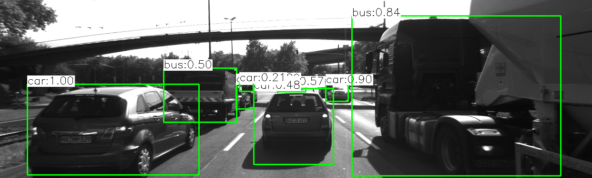

# Collision Avoidance System

Design of a collision avoidance system by fusing data from lidar and camera. Camera and Lidar sensor data is taken from KITTI dataset.


## High level architecture


Objective of the project is to estimate time to collision based on the inputs from camera and lidar sensors.

Following are the four major tasks to do this:

## Object classification



Object detection and classification is out of the scope of this project, for sake of simplicity quick and simple off-the-shelf deep learning based object detection and classification framework [YOLO](https://www.youtube.com/watch?v=NM6lrxy0bxs).

All the images from camera sensor is fed in to YOLO framework to obtain bounding boxes as shown in the image.


## Crop Lidar points

### Top view perspective of Lidar points

 


1. Points cloud received from Lidar sensor (10 Hz) is cropped to focus on ego lane

2. Later lidar points are transformed from lidar co-ordinate system to Homogeneous co-ordinate system.
3. Points in homogeneous system and projected to camera plane using calibration matrices (Provided by KITTI)

```
// assemble vector for matrix-vector-multiplication
X.at<double>(0, 0) = it1->x;
X.at<double>(1, 0) = it1->y;
X.at<double>(2, 0) = it1->z;
X.at<double>(3, 0) = 1;

// project Lidar point into camera
Y = P_rect_xx * R_rect_xx * RT * X;
cv::Point pt;
pt.x = Y.at<double>(0, 0) / Y.at<double>(0, 2);  // pixel coordinates
pt.y = Y.at<double>(1, 0) / Y.at<double>(0, 2);
```

4. Lidar Points in image plane that lies within bounding boxes are stored within the data structure boundingBox and the rest are filtered out. Points in each bounding box is shriked by the given percentage to avoid 3D object merging at the edges of an ROI


## Keypoints detection and their correspondences


By analyzing and comparing classic computer vision concepts HARRIS corner detection, SHITHOMASI against modern algorithms like FAST, SIFT, BRISK etc.., a robust mechanis is developed that can detect keypoints and generate descriptors. 

Descriptors from two images (current and previous) are then matched using suitable macthing (Brute Force or FLANN) and selector types (Nearest Neightbour or K-Nearest Neighbour).

Following are the different detectors, descriptors algorithms supported and compared in the project for speed and accuracy.

```
enum class DetectorTypeIndex
{
    FAST = 0,
    BRISK = 1,
    ORB = 2,
    AKAZE = 3,
    SIFT = 4,
    SHITOMASI = 5,
    HARRIS = 6
};

enum class DescriptorTypeIndex
{
    BRISK = 0,
    BRIEF = 1,
    ORB = 2,
    FREAK = 3,
    AKAZE = 4,
    SIFT = 5,
};
```

Detailed information about comparions between different detectors and descriptors can be found here,

[DetectorDescriptorAnalysis](https://docs.google.com/spreadsheets/d/1m-ptLTKXCUn8nhX25oxF452m0p5xW5rIebDYBdNSZgU/edit?usp=sharing)


## Match bounding boxes between two frames

Based on the matched keypoints, bounding boxes between teo consecutive images are compared and thier indices are matched based on the keypoint information.

## Calculating TTC (Time to Collision)

Based on the matched bounding box information time to collision is calculated separately using lidar and camera data.

### Using Lidar data

Implemented the estimation in a way that makes it robust against outliers which might be way too close and thus lead to faulty estimates of the TTC. For the lidar points that was processed earlier, time to collision is calculated by calculating the median of the lidar points along x axis (driving direction).

### Using Camera data

1. All the matched keypoints between current and previous images are iterated and distance between them is calculated, then median of those distances is calculated.
2. All the points that are of distance greater then `maxDistanceFromMedian` are filtered to remove the outliers.
3. A reliable TTC estimate with the median of all relative distance ratios​ between previous and current images.

## Display the computer TTC

In the final non-technical part, calculated TTC information from lidar and camera is rendered using `cv::imshow`, bounding box is rendered in red if the TTC is less than 7 seconds.


## Dependencies for Running Locally

### Using docker
```
$ docker pull ragumanjegowda/docker:latest
```

### Native (I have not tested this)

* cmake >= 2.8
  * All OSes: [click here for installation instructions](https://cmake.org/install/)
* make >= 4.1 (Linux, Mac), 3.81 (Windows)
  * Linux: make is installed by default on most Linux distros
  * Mac: [install Xcode command line tools to get make](https://developer.apple.com/xcode/features/)
  * Windows: [Click here for installation instructions](http://gnuwin32.sourceforge.net/packages/make.htm)
* Git LFS
  * Weight files are handled using [LFS](https://git-lfs.github.com/)
* OpenCV >= 4.1
  * This must be compiled from source using the `-D OPENCV_ENABLE_NONFREE=ON` cmake flag for testing the SIFT and SURF detectors.
  * The OpenCV 4.1.0 source code can be found [here](https://github.com/opencv/opencv/tree/4.1.0)
* gcc/g++ >= 5.4
  * Linux: gcc / g++ is installed by default on most Linux distros
  * Mac: same deal as make - [install Xcode command line tools](https://developer.apple.com/xcode/features/)
  * Windows: recommend using [MinGW](http://www.mingw.org/)


## Basic Build Instructions

```
$> mkdir build && cd build
$> cmake -G Ninja ..
$> ninja -j400
$> ./3D_object_tracking
```

## Credits

Based on Udacity's [SFND_3D_Object_Tracking](https://github.com/udacity/SFND_3D_Object_Tracking)